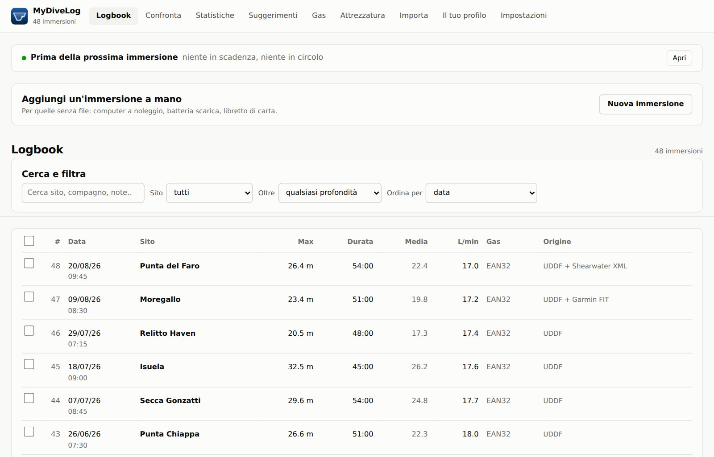
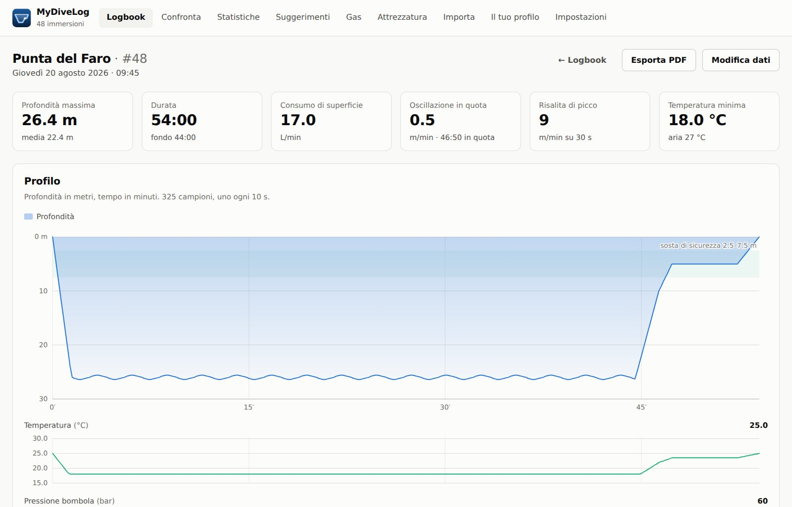
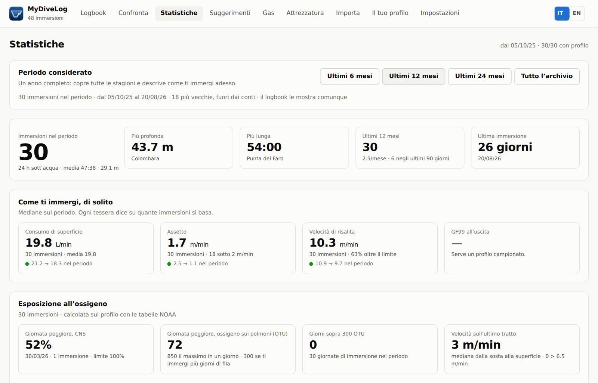
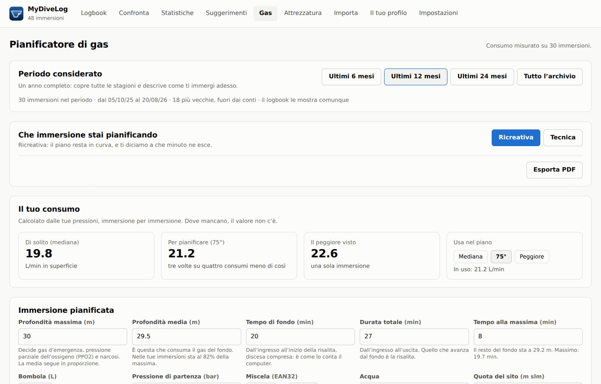

# MyDiveLog

Logbook subacqueo che importa da computer diversi, calcola statistiche e ne
ricava un piano di miglioramento.

App per macOS, iPhone, Windows e Android (Tauri), con lo stesso `src/` sotto
tutte e quattro. Interfaccia in italiano e in inglese, con un pulsante per
passare dall'una all'altra. Il sito è [mydivelog.site](https://mydivelog.site).

> **Non è un computer subacqueo e non sostituisce il tuo.**
> MyDiveLog contiene un'implementazione di Bühlmann ZH-L16C con gradient factor e
> una di VPM-B, usate per rileggere le immersioni già fatte e per preparare un
> piano in superficie. Il Bühlmann è confrontato con un Shearwater Peregrine su 38
> immersioni reali (scarto medio 0.8 punti di GF99, massimo 2.6); il VPM-B **non è
> ancora validato contro un'implementazione indipendente**. Nessuno dei due è
> certificato, nessuno dei due gira in acqua, e nessuno dei due sa che cosa stai
> facendo davvero: in immersione ha ragione il computer che hai al polso. Usa
> questi numeri per capire e per pianificare con la testa, mai come unica base di
> un'immersione decompressiva.

---

## Com'è fatta

Le schermate sono prodotte dall'applicazione vera con l'archivio dimostrativo
(`node scripts/immagini-sito.mjs`), quindi invecchiano insieme al programma.

| | |
|---|---|
|  |  |
| L'elenco, con da dove viene ogni immersione | La scheda: il profilo, e cosa dice |
|  |  |
| Le statistiche, con quante immersioni c'è dietro ogni numero | Il pianificatore, che parte dal tuo consumo vero |

---

## Scaricalo

**iPhone: [sull'App Store](https://apps.apple.com/app/mydivelog/id6804439480)**,
gratis, da iOS 15.

**macOS, Windows, Android e Linux stanno
[nelle release](https://github.com/matteoferrando/MyDiveLog/releases/latest)**, e
i pulsanti sono anche su [mydivelog.site](https://mydivelog.site).

| | File | Cosa sapere prima di scaricare |
|---|---|---|
| macOS | `MyDiveLog-macOS-arm64.dmg` | firmato Developer ID e **notarizzato**: doppio clic, niente «apri comunque». **Serve un Mac Apple Silicon e macOS 12** — su un Mac Intel installa e non si apre |
| Windows | `MyDiveLog-Windows-setup.exe`, oppure `MyDiveLog-Windows-portatile.exe` che non installa niente | firmato dal Mac, si aggiorna da solo. **Non l'ha provato nessuno su una macchina vera** |
| Android | `MyDiveLog-Android-arm64.apk` | **niente aggiornamento automatico**, e la firma non garantisce da chi viene il file: lo garantisce l'impronta SHA-256 pubblicata nelle note della release. **Non l'ha provato nessuno su un telefono vero** |
| Linux | `MyDiveLog-Linux-amd64.deb` | **niente aggiornamento automatico**. Vuole **WebKitGTK 4.1**, che c'è da **Ubuntu 24.04** e da **Debian 13** in su: su una distribuzione più vecchia `dpkg` lo rifiuta dicendo che manca `libwebkit2gtk-4.1-0`, e non è un difetto del pacchetto — quella libreria lì non esiste. È l'unica delle tre non-Apple che qualcuno **ha fatto partire davvero** prima di pubblicarla |

Non c'è un pacchetto per Mac Intel.

**Su Mac c'è anche Homebrew**, da un tap nostro:

```
brew tap matteoferrando/mydivelog
brew install --cask mydivelog
```

Non è in `homebrew-cask` ufficiale, e non per pigrizia: Homebrew chiede una prova
di interesse pubblico che questo progetto oggi non ha — per una cask proposta dal
proprietario del repository servono **90 fork, 90 watcher o 225 stelle**, e un
repository più giovane di trenta giorni di norma non è ammissibile. Un tap non ha
soglie, e la cask è la stessa: il giorno che i numeri ci sono si sposta senza
riscriverla.

> **Perché i limiti stanno PRIMA del pulsante e non dopo.** Costano qualche
> scaricamento in meno e risparmiano la delusione di scoprirli a installazione
> fatta — che è la forma peggiore, perché somiglia a un difetto di chi scarica.
> La riga su macOS 12 è lì per un motivo preciso: fino al 27 agosto 2026 il
> pacchetto **dichiarava 10.15** mentre il binario era solo arm64, e nessuno se
> n'era accorto. L'ha scoperto un controllo automatico di Apple, non un utente e
> non un test.

---

## Provalo in due minuti

```bash
npm install
npm run demo      # genera 6 file dimostrativi in demo/
npm run dev       # apre su http://localhost:1420
```

Trascina nella schermata **Importa** tutti i file della cartella `demo/`.
Sono 68 immersioni distribuite su cinque formati, ma in archivio ne entrano
**48**: le altre 20 sono la stessa immersione arrivata da fonti diverse, e
vengono riconosciute e unite invece che duplicate. È il comportamento che rende
utile un logbook multi-computer, e il modo più rapido di verificare che
funzioni.

`npm run dev` gira nel browser e salva i dati in IndexedDB. Per l'app desktop
vera, con database SQLite:

```bash
npm run desktop           # richiede Rust: https://rustup.rs
npm run desktop:build     # produce MyDiveLog.app e il .dmg
```

---

## Cosa fa

**Importa da più computer.** Il formato è riconosciuto dal *contenuto* del file,
non dall'estensione: un `.xml` può essere UDDF, Subsurface o Shearwater e i tre
vengono distinti correttamente.

| Formato | Cosa contiene | Come ottenerlo |
|---|---|---|
| **UDDF** | profilo, temperatura, tetto deco, PPO2, volume bombola | Shearwater Cloud Desktop → Export → UDDF |
| **Shearwater XML** | profilo completo, gas, GF | Shearwater Cloud Desktop → Export → XML |
| **Garmin FIT** | profilo, pressione dai trasmettitori T1/T2 | Garmin Connect, o cartella `ACTIVITY` del dispositivo |
| **Scubapro LogTRAK** | profilo, temperatura, volume e pressioni bombola, zavorra, fuso orario | app o desktop LogTRAK → Esporta (`.logtrak`) |
| **Shearwater Cloud** | il log nativo del computer: profilo, tetto deco, TTS, NDL, CNS, GF impostati, GPS | il database `.db` di Shearwater Cloud Desktop |
| **Subsurface** | tutto lo storico convertito da qualsiasi computer | Subsurface → Salva con nome (`.ssrf`) |
| **CSV** | riepilogo senza profilo | qualsiasi foglio di calcolo |

L'export FIT dell'app Suunto passa dallo stesso parser Garmin. È leggibile ma
povero: mancano il gas del trasmettitore e la composizione della miscela, che
vanno completati nella scheda immersione.

Il file LogTRAK è JSON, ma il profilo non è nel JSON: sta in un blob binario
Uwatec Smart dentro `diveLogBase64`, decodificato da
[`src/core/parsers/uwatecSmart.ts`](src/core/parsers/uwatecSmart.ts). Il formato
Uwatec **non contiene dati di decompressione** — né tetto, né NDL, né tempo in
deco: verificato sull'intero elenco dei tipi di record. Le soste obbligatorie
vengono riconosciute dal profilo, non lette dal file. Per verificare il decoder
su un export tuo:

```bash
npx tsx scripts/validate-logtrak.ts ~/Downloads/export.logtrak
```

Il JSON contiene profondità massima, durata e temperature già calcolate dal
computer, mentre il profilo è un blob separato: sono due fonti indipendenti degli
stessi numeri, quindi confrontarle è un test di correttezza vero. Su 104
immersioni reali di un Aladin Sport Matrix: temperature esatte al quanto del
sensore (0.4 °C), profondità massima entro 33 cm, zero byte residui.

Il database di **Shearwater Cloud** è un file SQLite, letto da
[`src/core/parsers/sqliteReader.ts`](src/core/parsers/sqliteReader.ts) — un
lettore scritto a mano, perché `sql.js` sono 1,5 MB di WebAssembly per fare
`SELECT * FROM due_tabelle`. Da qui arrivano due numeri che nessun altro formato
supportato fornisce: il **GF99 all'uscita** (quanto si è usciti sovrasaturi
rispetto al gradiente ammesso) e l'**obbligo decompressivo** effettivamente
incontrato. Il secondo cambia il quadro: le stesse immersioni importate da
LogTRAK sembravano tutte in curva, perché il formato Uwatec non contiene dati di
decompressione — unendo le due fonti se ne scoprono alcune con qualche minuto di
obbligo.

Il profilo di Shearwater Cloud invece non viene decodificato: è il formato binario
`sw-pnf` compresso, e per le stesse immersioni LogTRAK ha già un profilo
campionato più fitto (4 s contro 10 s). La deduplica tiene il profilo migliore e
prende da ciascuna fonte i campi che l'altra non ha.

**Calcola le metriche che dicono qualcosa.** Non solo profondità e durata:

- **consumo di superficie (RMV, L/min)** — confrontabile fra bombole e
  profondità diverse, a differenza dei bar/min;
- **oscillazione a quota tenuta (m/min verticali)** — metri verticali sprecati al
  minuto nei tratti in cui tieni la quota, discesa e risalita escluse. Il proxy
  più diretto del controllo d'assetto: sotto 2 m/min la quota è tenuta bene;
- **velocità di risalita** su finestra mobile di 30 s, con il tempo passato oltre
  i limiti, distinguendo sopra e sotto i 10 m;
- **sosta di sicurezza** effettivamente eseguita fra 3 e 6 m;
- **tempo in deco e violazioni del tetto**, con la durata di ciascuna;
- **riserva di gas all'uscita**, PPO2 di picco, END sulle miscele con elio.

Ogni metrica dichiara la propria affidabilità. Un profilo campionato ogni 30 s
non permette di misurare la velocità di risalita come uno a 2 s, e l'app lo dice
invece di far finta.

**Costruisce un piano.** Dieci regole valutano l'archivio e producono un elenco
ordinato per priorità, con: i numeri su cui si basa il giudizio, un obiettivo
misurabile, e gli esercizi da fare in acqua. Più una scheda di preparazione
verso un obiettivo (passaggio al tecnico, profondo ricreativo, miglioramento
generale) con i criteri soddisfatti e quelli mancanti.

Tre principi, perché un consiglio sbagliato è peggio di nessun consiglio:

1. **Niente diagnosi senza dati.** Ogni regola dichiara un minimo di immersioni
   valide sotto il quale non si pronuncia affatto.
2. **Ogni giudizio porta il suo numero**, così è verificabile e contestabile.
3. **Niente consigli che sostituiscano un istruttore.** Sulla decompressione e
   sulla progressione in profondità il piano indica cosa guardare, non cosa fare.

**Porta i dati fuori, in tre formati.** Un archivio chiuso dentro
un'applicazione è un archivio a rischio, e tre domande diverse vogliono tre
risposte diverse:

- **UDDF** ([`export/uddf.ts`](src/core/export/uddf.ts)) per portare le
  immersioni in un altro programma del settore. È rileggibile dal nostro stesso
  parser, ed è la proprietà che i test verificano;
- **CSV** ([`export/csv.ts`](src/core/export/csv.ts)) per farci in un foglio di
  calcolo quello che questa app non fa. Una riga per immersione, quarantatré
  colonne con l'unità scritta nell'intestazione. Il separatore segue la lingua —
  punto e virgola e decimali con la virgola in italiano, virgola e punto in
  inglese — perché sbagliare quella coppia non dà nessun errore: apre il file in
  una colonna sola, o fa entrare i numeri come testo;
- **KML** ([`export/kml.ts`](src/core/export/kml.ts)) per vedere i siti su una
  mappa vera. Un segnaposto per sito e non per immersione, con dentro quante
  volte ci sei stato e quando; i siti di cui nessun formato d'origine porta le
  coordinate vengono elencati invece di sparire.

Più il **backup completo in JSON**, che è l'unico che riporta indietro tutto:
immersioni, profili, attrezzatura, brevetti e piani.

**Tiene un solo archivio su più dispositivi.** Facoltativo: si entra con un
account **Apple o Google** e il servizio crea un database libSQL/Turso tutto tuo — indirizzo
e token si possono ancora incollare a mano, sotto «Avanzate», per chi il database
se l'è fatto da sé. Il database locale resta la fonte di verità e la
sincronizzazione è un'operazione che lanci tu — l'app si apre e funziona identica
senza rete, perché un logbook si consulta anche in barca.

Cosa garantisce, e cosa no:

- **Non duplica.** L'identificativo di un'immersione dipende dal suo contenuto:
  la stessa immersione importata su due dispositivi resta una.
- **Riepilogo e profilo viaggiano separati.** Se un dispositivo ha le note e
  l'altro il profilo campione per campione, dopo la sincronizzazione entrambi
  hanno entrambi. Una regola sola per tutto il record perderebbe uno dei due.
- **Le cancellazioni viaggiano, il cestino no.** Finché un'immersione è nel
  cestino resta solo sul dispositivo dove l'hai buttata: ripescarla dev'essere
  sempre possibile. Svuotando il cestino nasce la lapide — «questa è stata
  cancellata, e quando» — che è l'unica informazione capace di distinguere «non
  ce l'ho ancora» da «l'ho buttata via».
- **Sincronizzare due volte di fila non fa niente la seconda volta.** È la
  proprietà su cui insistono i test: un piano non idempotente fa rimpallare le
  immersioni fra due dispositivi per sempre.

Nessun token è nel codice né nel repository: vivono nel portachiavi di sistema
(o, sul web, nell'archivio locale), sul dispositivo dove sono nati.

---

## Comandi

| Comando | Cosa fa |
|---|---|
| `npm run dev` | sviluppo nel browser (dati in IndexedDB) |
| `npm run desktop` | app desktop in sviluppo (dati in SQLite) |
| `npm run desktop:build` | `.app` + `.dmg` per macOS |
| `npm test` | 1700+ prove su unità, parser, formati binari Uwatec e Shearwater, gzip/DEFLATE, lettore SQLite, metriche, deduplica, fusi orari, sincronizzazione, piano, grafici, e sul sito |
| `npm run validate:logtrak <file>` | verifica il decoder Uwatec contro un export LogTRAK reale |
| `npm run validate:pnf <file.db>` | verifica il decoder Shearwater contro un database di Shearwater Cloud reale |
| `npm run typecheck` | controllo dei tipi |
| `npm run demo` | rigenera i file dimostrativi in `demo/` |
| `npm run screenshot` | verifica visiva: apre la build, fotografa ogni vista e fa un giro in inglese |
| `npm run schermate:ble` | le schermate dello scarico Bluetooth, che nel browser non esistono: compila con un finto computer subacqueo (`VITE_FINTO_BLUETOOTH=1`, cartella `dist-ble/`), fotografa elenco, avanzamento, esito, interruzione e guasti a 390 e 1280 px, e misura il trabocco orizzontale di ogni contenitore. Esce con errore se qualcosa sfora |
| `node scripts/immagini-sito.mjs` | rigenera le fotografie del sito, in italiano e in inglese |
| `npm run ios:init` | genera il progetto Xcode per iOS (vedi sotto) |
| `npm run ios:dev -- "iPhone 17 Pro"` | compila e lancia l'app sul simulatore |
| `npm run ios:build` | pacchetto firmato per un iPhone vero |
| `npm run mac:pubblica` | `.dmg` firmato **e notarizzato**, da allegare a una release |

---

## iOS

Il guscio iOS non e' una porta: e' lo stesso `src/` compilato dentro un progetto
Xcode che Tauri genera in `src-tauri/gen/apple/`. Quella cartella e' **generata e
non versionata**, e questo e' il fatto da cui discendono tutte le insidie qui
sotto: qualunque cosa si sistemi a mano dentro `gen/apple/` sparisce alla prima
rigenerazione, o semplicemente non esiste per chi clona il repository. La
configurazione deve stare a monte, in `src-tauri/tauri.conf.json` e in
`src-tauri/Info.ios.plist`, che sono versionati.

**CoreBluetooth va dichiarato, altrimenti non si arriva nemmeno a lanciare
l'app.** `btleplug` — il motore su cui poggia `tauri-plugin-blec` — chiama
CoreBluetooth via FFI: il codice Rust compila benissimo senza il framework,
perche' i simboli mancanti si scoprono solo al *link*. L'errore che si vede e'
`Undefined symbols for architecture arm64: _CBCentralManagerScanOptionAllowDuplicatesKey`
e simili, e non nomina ne' il Bluetooth ne' il plugin: sembra un guasto del
progetto Xcode. La cura sta in una riga di `tauri.conf.json`:

```json
"iOS": { "minimumSystemVersion": "15.0", "frameworks": ["CoreBluetooth"] }
```

Vale anche per il simulatore, che di CoreBluetooth ha solo la versione finta —
ma la versione finta va comunque linkata.

**`tauri ios init` non riscrive i file che trova gia' li'.** E' la trappola che
fa perdere piu' tempo: si aggiunge `frameworks` alla configurazione, si rilancia
`npm run ios:init`, il comando dice «Project generated successfully» e non e'
cambiato niente, perche' `gen/apple/project.yml` — il file dove finisce l'elenco
dei framework — esisteva gia'. Per far ripartire davvero la generazione bisogna
togliere di mezzo il file vecchio:

```sh
mv src-tauri/gen/apple/project.yml /tmp/project.yml.vecchio
npm run ios:init
```

e poi verificare che `- sdk: CoreBluetooth.framework` compaia davvero fra le
`dependencies` del target. In generale: dopo ogni modifica alla sezione `iOS`
della configurazione, controllare il `project.yml` risultante, non fidarsi del
messaggio di successo.

**Xcode «aggiorna alle impostazioni consigliate» e rompe la build.** Aprendo il
progetto, Xcode 26 propone l'aggiornamento e scrive nel `.xcodeproj`
`ENABLE_USER_SCRIPT_SANDBOXING = YES`. Con quella impostazione la fase «Build
Rust Code» gira in una sandbox che le lascia leggere solo i file dichiarati come
input, e `tauri ios xcode-script` deve leggere `project.pbxproj`: il messaggio
che si vede e' `failed to read project.pbxproj file: Operation not permitted (os
error 1)`, che sembra un problema di permessi del disco e non lo e'. Il
`.xcodeproj` e' generato, quindi la cura e' rigenerarlo — ed e' il motivo per cui
`npm run ios:dev` e `npm run ios:build` fanno `tauri ios init` prima di
compilare: costa dieci secondi e toglie di mezzo tutta la categoria di guasti in
cui Xcode modifica un progetto che non e' suo. Se Xcode lo propone, rispondere di
no.

**I permessi stanno in `src-tauri/Info.ios.plist`.** Tauri lo fonde con
l'`Info.plist` generato, ma **al momento della build, non dell'init**: subito
dopo `ios:init` il plist in `gen/apple/` non contiene ancora
`NSBluetoothAlwaysUsageDescription`, e questo e' normale. Si verifica dopo un
`ios:dev`, con
`plutil -p src-tauri/gen/apple/mydivelog_iOS/Info.plist | grep -i bluetooth`.
Senza quella chiave iOS 13+ non fa nemmeno partire CoreBluetooth, e il sintomo e'
l'app terminata dal sistema al primo scan: assomiglia a un crash nostro.

**Su iPhone i file non si «scaricano».** Dentro la WKWebView un `<a download>`
non fa niente e — questa e' la parte pericolosa — non lancia nessun errore: il
codice JavaScript non ha modo di accorgersene, quindi l'interfaccia dichiarava
«Backup scritto» senza aver scritto niente. Tutte le esportazioni passano ora da
`src/ui/esporta.ts`, che su iOS chiama un comando Rust
(`esporta_nei_documenti`) e scrive nella cartella Documenti dell'app — visibile
nell'app File grazie alle due chiavi di `Info.ios.plist` — e che **lancia**
quando non riesce. Un test di sorgente (`tests/iosGuardie.test.ts`) impedisce
che ne rinasca una quarta copia: era gia' successo tre volte.

**Mettere l'app su un iPhone vero.** `npm run ios:telefono` — cioe'
`tauri ios run --release` — compila, firma, installa e lancia sul telefono
collegato, con l'interfaccia impacchettata dentro: l'app resta sul telefono e non
dipende dal Mac acceso, a differenza di `ios:dev` che serve la pagina da Vite.
Due condizioni: il telefono dev'essere **collegato almeno una volta** prima della
prima build (senza un dispositivo registrato Apple non emette il profilo, e
l'errore e' `Your team has no devices from which to generate a provisioning
profile`), e sul telefono dev'essere attiva **Modalita' sviluppatore**
(Impostazioni → Privacy e sicurezza), obbligatoria da iOS 16.

Con un **Personal Team** — l'account Apple gratuito — il profilo dura **sette
giorni**: dopo, l'app non si apre piu' e va reinstallata con lo stesso comando.
Reinstallare SOPRA conserva l'archivio; cancellare l'app lo butta, ed e' uno dei
motivi per cui la sincronizzazione non e' un accessorio.

**Su iPhone non si stampa, e il pulsante non c'e'.** La stampa apre una finestra
nuova col foglio impaginato e passa la parola alla finestra di stampa del
sistema: dentro la WKWebView non esiste ne' l'una ne' l'altra — `window.open`
restituisce null e `window.print()` non fa niente. I due pulsanti (scheda
immersione e piano) sono nascosti da `!suIOS()`: prima restavano visibili e,
premuti, davano la colpa al blocco dei popup, cioe' mandavano a cercare
un'impostazione inesistente per un problema che non era quello. Il foglio si
stampa dal Mac, dove l'archivio e' lo stesso.

**iOS non manda gli eventi del mouse.** `mousemove` e `mouseenter` non esistono
sotto il dito: un grafico che li usa non risponde e non segnala niente. Vale per
`onMouseMove`, `onMouseEnter`, `onMouseLeave` e anche per un
`addEventListener('mousedown')` sul documento, che iOS sintetizza solo sugli
elementi che considera cliccabili. Si usano gli eventi del puntatore, e lo
stesso test di sorgente lo verifica.

**Il permesso Bluetooth negato NON e' silenzioso, anche se per mesi qui c'era
scritto il contrario.** `checkPermissions` di `tauri-plugin-blec` e' implementato
solo per Android e altrove risponde sempre di si'; lo stato dell'adattatore ha
tre valori e nessuno significa «non autorizzato». Da questi due fatti — veri — si
era concluso che chi tocca «Non consentire» non ricevesse nessun errore. Falso:
l'errore lo lancia **`scan()`**, e si legge `Btleplug error: Permission denied`.
Si guardavano i due posti in cui l'informazione non c'era e non il terzo in cui
c'era, e a smentirlo e' stato il primo utente esterno dell'app, il 28 agosto
2026, con quella riga sullo schermo del suo iPhone.

Adesso l'errore si classifica (`src/core/ble/causaGuasto.ts`) e il messaggio dice
dove si concede il permesso — su iPhone Impostazioni → MyDiveLog → Bluetooth, non
il pannello di macOS. Il riquadro dopo dodici secondi di ricerca a vuoto resta,
per i casi che sono ancora muti davvero: computer spento, lontano o non in
modalita' collegamento, e il pannello del permesso mai comparso.

**E un messaggio d'errore non porta mai il nome di una libreria.** «Btleplug» non
vuol dire niente per chi legge, ed era in inglese dentro un'app italiana:
`tests/permessoBluetooth.test.ts` impedisce che ci ritorni.

**Il simulatore non ha Bluetooth vero.** Serve a verificare layout, navigazione,
import da file e tutto il resto; per provare lo scarico da un computer subacqueo
serve un iPhone fisico, e quindi la firma con un account Apple.

---

## Struttura

```
src/
  core/                      ← logica pura, nessuna dipendenza da piattaforma
    model.ts                   modello canonico e unità di misura
    units.ts                   conversioni e fisica dell'immersione
    dedupe.ts                  riconoscimento della stessa immersione
    traduci.ts                 il tipo `Traduci`: `src/core` non importa da `src/ui`
    export/                    UDDF, CSV, KML, backup completo, stampa
    parsers/                   un file per formato + rilevamento
      uwatecSmart.ts             decoder del bitstream binario Scubapro/Uwatec
      shearwaterPnf.ts           decoder del log nativo dei computer Shearwater
      inflate.ts                 gzip e DEFLATE, senza dipendenze
      sqliteReader.ts            lettore di file SQLite, senza dipendenze
    analysis/
      metrics.ts               metriche per singola immersione
      aggregate.ts             statistiche, tendenze, correlazioni, distribuzioni
      coaching.ts              regole del piano di miglioramento
      window.ts                finestra temporale (12 mesi per difetto)
  storage/                   ← due implementazioni, una interfaccia
    sqlite.ts                  desktop e iOS
    indexeddb.ts               web
    repair.ts                  ricalcolo delle metriche incoerenti all'avvio
  sync/                      ← database condiviso, facoltativo
    plan.ts                    cosa spostare e in che direzione (senza rete)
    turso.ts                   trasporto libSQL + schema remoto
    account.ts                 sessione lunga, chiave del database corta
    googleAccesso.ts           OAuth con PKCE: prepara il giro, legge il ritorno
    appleAccesso.ts            «Accedi con Apple»: giro web, `form_post`, nome solo la prima volta
    accessoPiattaforma.ts      il ritorno dal browser: porta locale sul Mac, schema URL su iPhone
    pkce.ts                    verificatore e sfida
  ai/                        ← NON entra nell'applicazione: serve a `npm run dump:ai`
    context.ts                 i dati misurati, compattati per la lettura
    prompts.ts                 istruzioni: niente numeri inventati
  ui/                        ← React: pagine, grafici, stato
    lingua.tsx                 italiano e inglese: la chiave è la frase italiana
    traduzioni.ts              il dizionario inglese, caricato solo per chi lo sceglie
    navigazione.tsx            «vai a quella scheda», per gli stati vuoti
src-tauri/                   ← guscio nativo (plugin SQL, Bluetooth, ritorno dall'accesso)
server/                      ← il servizio di accesso: tre rotte, nessuna dipendenza
  worker.ts                    /accesso, /chiave, /account
  identita.ts                  verifica del token di Apple e di Google (JWKS, RS256, iss, aud, exp)
  googleScambio.ts             lo scambio del codice, con il segreto che non sta nell'app
  appleScambio.ts              lo stesso per Apple, più il rimbalzo della POST di Apple
  sessione.ts                  firma e verifica delle sessioni; l'identità è un'impronta
  turso.ts                     crea il database della persona via Platform API
tests/                       ← test + generatore di immersioni sintetiche
```

Tutto quello che conta sta in `src/core`: non importa niente, non conosce React
né Tauri, e viene riusato identico su desktop, iOS e web. Il guscio nativo fa
una cosa sola — aprire un vero file SQLite — perché è l'unica che il web non può
fare.

Dettagli sulle scelte di architettura e sul percorso verso iOS e web:
[`docs/architettura.md`](docs/architettura.md).

---

## Le insidie dei formati, in breve

Documentate nei commenti di ciascun parser, perché sono la ragione per cui i
logbook fatti in casa danno numeri sbagliati:

- **UDDF è interamente SI.** `<tankpressure>20000000</tankpressure>` sono 200
  bar, non 20 milioni di qualcosa. La temperatura è in Kelvin, il volume in
  metri cubi, le frazioni di gas fra 0 e 1.
- **Shearwater salva la pressione bombola in MEZZI PSI.** Il valore va
  moltiplicato per 2 prima di convertirlo, e il fattore non è nel nome del
  campo. Il flag `imperialUnits` decide come leggere profondità e temperatura
  *nello stesso file*; `startSurfacePressure` è in millibar.
- **I campioni Subsurface sono delta-codificati.** Un attributo assente non vuol
  dire "sconosciuto", vuol dire "come prima". Un parser che non riporta avanti i
  valori produce profili di temperatura a buchi.
- **Nel FIT la pressione bombola non sta nei record.** Sta in messaggi
  `tank_update` separati, da agganciare per timestamp. E il volume della bombola
  non esiste: viene dedotto da `tank_summary`.
- **`<divelog>` e `<diveLog>` sono formati diversi.** Un confronto
  case-insensitive manda i file Shearwater nel parser Subsurface.
- **Nel binario Uwatec l'intestazione è little endian e i dati dentro un record
  sono big endian.** Non è un errore di trascrizione, sono davvero diversi. I
  campioni sono un bitstream a lunghezza variabile con delta a 4 e 7 bit *con
  segno*: `0x7F` è −1, non 127. Un bit letto male non dà errore, dà un profilo
  plausibile e falso.
- **`deviceTypeNumber` 21 e 23 sono due computer diversi con intestazioni di
  dimensione diversa** (152 e 84 byte), e LogTRAK chiama entrambi
  `aladin_sport`. Fidarsi della stringa invece del numero significa leggere i
  campioni dall'offset sbagliato.
- **Il computer registra anche i minuti passati in superficie dopo la risalita.**
  Su un'immersione da 35 minuti ho trovato 5 minuti di zeri in coda: lasciarli
  dentro abbassa la profondità media e falsa il consumo.

- **Nel formato dei record SQLite la soglia del payload locale va calcolata con
  aritmetica INTERA.** Riprodurla con i float sbaglia di un byte su pagine da 512,
  il puntatore alla pagina di overflow viene letto dal posto sbagliato e il blob
  esce troncato senza nessun errore. Con dati tutti a zero non si nota nemmeno.

La deduplica è la stessa euristica di Subsurface (`dive::likely_same`), portata
in TypeScript: finestra temporale variabile pari a metà della durata
dell'immersione più lunga, con un minimo di 60 secondi, più controlli
proporzionali su profondità e durata. La finestra variabile è ciò che la fa
funzionare con computer i cui orologi vanno alla deriva; i controlli su
profondità e durata sono ciò che evita di fondere due immersioni ripetitive
fatte sullo stesso sito.

A questo si aggiunge il riconoscimento degli **sfasamenti fra orologi**. Due
computer allo stesso polso possono avere l'ora impostata diversamente — uno su
UTC, l'altro sull'ora locale, o uno che non ha ricevuto il cambio dell'ora legale
— e in quel caso la stessa immersione risulta a un'ora di distanza in ogni
confronto. `inferClockOffsets` stima gli scarti guardando la *distribuzione* delle
differenze fra immersioni che coincidono per profondità e durata: se molte si
accumulano attorno allo stesso valore, quello è lo sfasamento. Ne riconosce anche
più di uno per import, perché nei dati reali accade che un orologio venga corretto
a metà dello storico.

---

## Test

```bash
npm test
```

Il test che conta di più: la stessa immersione sintetica, scritta in sei formati
con sei convenzioni di unità diverse, deve tornare identica nel modello canonico.
Se qualcuno dimentica il fattore 2 dei mezzi PSI o legge i Pascal come bar, il
test lo prende prima dell'utente.

Per il binario Uwatec i test fanno un round-trip: `tests/fixtures.ts` contiene un
encoder che produce blob validi con profondità e temperature *scelte*, e il
decoder deve restituirle. Più i controlli che valgono su qualunque file — byte
consumati pari a quelli dichiarati, unità dell'intestazione, estensione del segno
sui delta negativi.

I dati di prova sono generati, non registrati: `tests/fixtures.ts` costruisce
profili con consumo, assetto e velocità di risalita *scelti*, così i test
possono verificare che le metriche ricostruiscano i valori di partenza.

Quello che i test unitari **non** vedono è la geometria: una curva che esce dal
grafico, un'etichetta che ne copre un'altra, una traduzione inglese più lunga
dell'italiano che manda a capo un pulsante. Per quello c'è la harness:

```bash
npm run build && npm run demo
node scripts/screenshot.mjs      # fotografa ogni vista e stampa cosa ha trovato
```

Non fa solo fotografie: misura il trabocco orizzontale a 390 px, l'altezza dei
bersagli tattili, che la conferma di cancellazione si armi davvero, e in fondo
fa un giro in inglese per vedere che nessuna voce di navigazione sia rimasta
italiana. È il posto dove sono stati presi quasi tutti i difetti d'interfaccia
di questo progetto.

---

## Distribuire il pacchetto macOS

`npm run desktop:build` produce un `.app` firmato con il certificato di sviluppo:
vale sul computer che l'ha compilato e su nessun altro. Da un `.dmg` così, macOS
dice a chi lo apre che «l'app è danneggiata o proviene da uno sviluppatore non
identificato» — una frase che fa cancellare il file, non cercare la scorciatoia.

`npm run mac:pubblica` fa la cosa giusta: firma con un certificato **Developer ID
Application**, manda il pacchetto a notarizzare ad Apple, aspetta la risposta,
graffetta l'esito al `.dmg` — così vale anche per chi lo apre senza rete — e alla
fine ripete la prova che farebbe macOS a chi scarica.

Due cose vanno create una volta sola, e non le può creare uno script:

1. il certificato *Developer ID Application*, da Xcode → Impostazioni → Account →
   *Manage Certificates* → **+**;
2. le credenziali di notarizzazione nel portachiavi:
   `xcrun notarytool store-credentials mydivelog --apple-id … --team-id …`,
   che chiede una password specifica per l'app generata su appleid.apple.com.

Lo script controlla che entrambe ci siano **prima** di compilare, perché
scoprirlo dopo venti minuti di build è il modo peggiore.

---

## La cask di Homebrew non si scrive a mano

`homebrew/mydivelog.rb` è **generato** da `npm run cask`, e finisce nel tap
[`matteoferrando/homebrew-mydivelog`](https://github.com/matteoferrando/homebrew-mydivelog).

Una cask dichiara una versione e uno `sha256`. Se il secondo non è l'impronta del
file che la prima indica, `brew install` si ferma con «checksum mismatch» — e lo
scopre **chi prova a installare**, non chi ha pubblicato. Aggiornata a mano, prima
o poi porta la versione nuova e l'impronta della precedente.

**L'impronta viene dall'API di GitHub**, cioè è calcolata sul file che GitHub sta
davvero servendo — non su quello costruito qui. È una differenza che conta:
quello che la gente scarica è il primo, e una cask che descrivesse il secondo
sarebbe giusta rispetto a un file che nessuno riceve. Con `--dmg <file>` si
calcola anche l'impronta del pacchetto locale e si pretende che combacino: se
divergono lo script si ferma invece di pubblicare una cask che punta a un file
diverso da quello provato.

A ogni rilascio, dopo aver pubblicato la release:

```
npm run cask
cp homebrew/mydivelog.rb ../homebrew-mydivelog/Casks/mydivelog.rb
cd ../homebrew-mydivelog && git commit -am "1.7.x" && git push
brew fetch --cask matteoferrando/mydivelog/mydivelog   # scarica e verifica l'impronta
brew audit --cask --online matteoferrando/mydivelog/mydivelog
```

> **`brew` è l'unico giudice che conta, e va interpellato prima di pubblicare.**
> La prima versione di questa cask passava le nostre prove e brew la leggeva
> segnalando una forma deprecata a ogni comando: `depends_on macos: ">= :monterey"`
> invece del simbolo nudo. Nessuna prova di testo sa quali forme Homebrew abbia
> deprecato la settimana scorsa.

`tests/cask.test.ts` difende quello che si può difendere senza rete: che la
versione sia quella del progetto, che l'indirizzo punti alla versione e non a
«latest» — l'impronta è di UN file, e «latest» domani è un altro — che ci sia
`auto_updates true`, che i limiti dichiarati siano gli stessi che il sito scrive
prima del pulsante, e che lo `zap` nomini l'identificatore vero.

---

## Computer subacquei: i due di casa e gli altri trecentocinquanta

L'applicazione ha due driver Bluetooth scritti a mano — Shearwater e
Scubapro/Uwatec — verificati su computer veri. Bastano a chi li possiede e a
nessun altro.

La funzionalità cargo **`computer-esterni`** compila
[libdivecomputer](https://libdivecomputer.org) dentro il guscio Rust: **356
modelli, 110 dei quali parlano Bluetooth LE**. Il sorgente è vendorizzato in
`src-tauri/vendor/`, si compila da sé, e non serve né bindgen né autoconf.

```sh
cargo build --features computer-esterni    # dentro src-tauri/
```

**È spenta di sua iniziativa**, ed è una funzionalità di sviluppo: non entra nei
pacchetti che si pubblicano.

Due ragioni. La prima, piccola: centoquindici file C prima di ogni build pulita
non li deve pagare chi lavora su una schermata. La seconda, che pesa di più:
**nessun computer subacqueo di terzi è mai stato collegato a questo codice.** La
catena è scritta per intero — trasporto, scarico, traduzione nel modello
canonico, ponte sul Bluetooth, selettore di marca e modello — e tutto quello che
si può inchiodare senza hardware è inchiodato: il trasporto contro un flusso
finto, l'accorpamento dei campioni, la traduzione contro immersioni sintetiche.
Il resto è una promessa finché qualcuno non accende un computer vero e guarda
cosa succede.

Per questo, nel selettore, i modelli che passerebbero di lì lo dichiarano: «via
libdivecomputer, mai provato su questo modello». Accendere la funzionalità prima
di quella prova vorrebbe dire offrire un pulsante «Scarica» che potrebbe non
funzionare — e in un logbook una lettura sbagliata non dà errore: dà un profilo
plausibile e falso.

### Le due implementazioni danno gli stessi numeri, e lo sappiamo

Il decoder Uwatec scritto a mano e quello di libdivecomputer sono stati messi uno
accanto all'altro sugli stessi byte: **85 immersioni reali, 64 706 campioni di
profondità confrontati uno per uno, zero differenze**, scarto massimo 0,00 m.
Coincidono anche durata, profondità massima, temperature e numero di campioni.

Conta per due ragioni. La prima è che il nostro decoder è giusto, e non «sembra
giusto»: su un bitstream a delta un errore non produce un errore, produce un
profilo plausibile e falso. La seconda è che **le due strade sono
intercambiabili**, quindi affidare gli Uwatec a libdivecomputer non cambierebbe
un centimetro dei numeri già in archivio.

Il confronto si rifà quando serve — vedi
[`scripts/confronto-ldc/`](scripts/confronto-ldc/).

---

## Due lingue

L'interfaccia è in italiano e in inglese, e il pulsante `IT`/`EN` sta nella barra
in alto — sul telefono dentro il menu, perché in barra non ci stava senza far
scorrere la pagina di lato. Alla prima apertura la lingua è quella del sistema;
la scelta si ricorda in `localStorage`, non nell'archivio, perché è una
preferenza di *questo* dispositivo: cambiarla sul telefono non deve cambiarla
sul Mac.

**La chiave del dizionario è la frase italiana**, in stile gettext:

```tsx
const { t } = useLingua();
<h2>{t('Nessuna immersione in archivio')}</h2>
```

Una frase che non è nel dizionario esce in italiano, che è la chiave: il
programma resta usabile anche a traduzione incompleta, e non compaiono mai
sigle tipo `logbook.vuoto.titolo` al posto di un testo. Il prezzo è che
cambiando la frase italiana si perde la sua traduzione — ed è il prezzo giusto
qui: le chiavi astratte costringono a saltare in un altro file per sapere cosa
c'è scritto a schermo.

Il dizionario ([`src/ui/traduzioni.ts`](src/ui/traduzioni.ts), circa
millecinquecento voci) arriva con un `import()` pigro e **solo per chi sceglie
l'inglese**: sono 89 kB che nel pezzo di codice del primo avvio non entrano, e
che chi usa l'app in italiano non scarica mai.

Anche il testo che **non** nasce nell'interfaccia è tradotto: gli avvisi dei
parser, le righe del registro di sincronizzazione, i messaggi d'errore
dell'archivio. `src/core` non può importare da `src/ui`, quindi il tipo sta in
[`src/core/traduci.ts`](src/core/traduci.ts) e ogni funzione che produce testo lo
riceve come ultimo parametro, con l'identità come valore predefinito — nessun
chiamante esistente ha dovuto cambiare, test compresi.

Per aggiungere una lingua servono un file come `traduzioni.ts` e una riga in
`lingua.tsx`. Per trovare le frasi ancora da tradurre:

```bash
npm run build && node scripts/screenshot.mjs   # il giro finale è in inglese
```

---

## Accesso con Apple o Google, facoltativo

Dalla scheda *Sincronizza* si può entrare con un account **Apple** o con un
account **Google**. Serve a una cosa sola: **avere un database proprio senza doverselo creare**. L'app chiede al
servizio una chiave, il servizio crea il database al primo accesso e la chiave
dura due ore. Chi il database se l'è già fatto da sé continua a incollare
indirizzo e token, in un campo che è ancora lì ma è finito sotto **Avanzate**:
è la via di scampo per il giorno che il servizio di accesso non risponde e la
sessione è scaduta, non più una strada di pari dignità.

**Non è un cancello.** Il logbook si apre e funziona senza aver mai fatto
l'accesso, perché l'archivio è sul dispositivo. Questo è il vincolo che ha
guidato ogni decisione qui sotto.

Come è fatto, e perché così:

- **Un database per persona, non una tabella con la colonna del proprietario.**
  L'isolamento è fisico: non c'è nessuna query da sbagliare, e il motore di
  sincronizzazione resta quello di prima, perché ognuno ha già oggi un database
  tutto suo. Provato, non affermato: la chiave di un account di prova risponde
  **401** sul database di un altro.
- **Il servizio non ha uno stato.** Nessuna tabella di utenti: il nome del
  database si ricava dall'identità con un'impronta di `provider:sub`. Non
  esiste un file che colleghi un'email a un archivio, e non c'è niente da
  migrare. Il prezzo, dichiarato: non si può revocare una singola sessione prima
  della scadenza.
- **La sessione sta nel portachiavi, la chiave del database no.** La chiave vive
  solo in memoria e dura due ore. Un archivio SQLite finisce nei backup di
  sistema, e una credenziale scritta là dentro sopravvive a chi l'ha generata.
- **L'accesso passa dal browser di sistema, mai da una finestra nostra.** Una
  pagina di accesso disegnata dentro l'applicazione è indistinguibile da una
  finta: chi la guarda non vede né l'indirizzo né il lucchetto.
- **Il ritorno dal browser è diverso sulle due piattaforme, e non per capriccio.**
  Sul Mac è una porta su `127.0.0.1` aperta dal processo per il tempo di un
  accesso; su iPhone è uno schema URL, perché aprendo il browser l'app va in
  secondo piano e la porta smetterebbe di rispondere. In entrambi i casi la
  difesa è la stessa: quello che torna senza uno `state` che combacia non viene
  guardato.
- **Lo scambio del codice avviene sul servizio, non nell'app.** Google, per i
  client di tipo «Desktop app», pretende un `client_secret` anche con PKCE — e un
  segreto dentro un pacchetto che chiunque può aprire non è un segreto. Sta fra i
  segreti di Cloudflare. Conseguenza: l'app non vede mai un token di Google, e
  iPhone e Mac fanno la stessa identica strada.

### Apple ha una regola in più, e cambia la forma del servizio

Vale tutto quello che sta scritto qui sopra, e in più due cose che riguardano
solo Apple.

- **Il ritorno di Apple è una POST, non una GET.** Quando le si chiedono nome ed
  email, Apple rimanda l'utente con un `response_mode=form_post`: una POST
  `application/x-www-form-urlencoded` che parte dal browser di chi sta
  accedendo. Un browser non può inoltrare quella POST a `127.0.0.1` né a uno
  schema URL, quindi la riceve il servizio — `POST /accesso-apple/ritorno` — e
  la rimbalza dentro l'applicazione con un 303. È la ragione per cui il Worker
  ha una rotta che Google non usa; il ragionamento per esteso sta in testa a
  `server/appleScambio.ts`.
- **Il nome arriva una volta sola, alla prima autorizzazione.** Apple lo manda
  nel corpo della POST e mai più, nemmeno se si riaccede: se non lo si prende
  lì, non lo si prende più — l'unico modo di rivederlo è che l'utente revochi
  l'accesso dalle impostazioni del proprio ID Apple.
- **Sul Mac e su iPhone il giro è lo stesso**, ed è quello *web* con un Services
  ID: non serve l'entitlement `com.apple.developer.applesignin` né un profilo
  di provisioning dedicato. Una strada sola invece di due è una strada sola da
  provare, e da riparare.

Il servizio sta in [`server/`](server/), è un Worker Cloudflare senza nessuna
dipendenza npm, e nel repository non entra nessuna credenziale. **Le rotte, i
segreti e le differenze fra i due fornitori sono documentati per esteso in
[`server/README.md`](server/README.md)** — che è il posto dove guardare quando
un accesso non va.

---

## Privacy

Nessun dato lascia il dispositivo, a meno che tu non colleghi un database
condiviso dalla scheda *Sincronizza* — con l'accesso o incollando un token — e
anche allora **solo quando premi Sincronizza**. Non c'è telemetria e non c'è
nessun altro destinatario. Se fai l'accesso, il servizio vede il tuo indirizzo
email il tempo di rispondere e non lo conserva: quello che resta è un'impronta
dell'identificativo che Google ci dà, da cui si ricava il nome del database. Le
immersioni non passano dal servizio: viaggiano fra l'app e il database, come
prima.

Su desktop il database è un file SQLite nella cartella dati
dell'app: copiabile, versionabile e ispezionabile con qualsiasi strumento
SQLite. Il guscio nativo ha i permessi del solo plugin SQL — niente shell,
niente accesso al filesystem arbitrario.

---

## Licenza e riconoscimenti

MIT — vedi [LICENSE](LICENSE). **Il codice dell'applicazione è tutto MIT.**

L'unica eccezione è **libdivecomputer**, vendorizzata in `src-tauri/vendor/`, che
è **LGPL-2.1** e porta la propria licenza dentro il tarball. Viene compilata solo
con la funzionalità cargo `computer-esterni`, che è di sviluppo e non entra nei
pacchetti pubblicati.

Il tarball è versionato e la build lo scompatta **da lì**, non da una copia
scaricata al momento: chiunque abbia questo repository ha gli **stessi byte**
contro cui è stato compilato tutto quanto. È una scelta deliberata — evita di
pretendere autoconf su ogni macchina che compila — ed è anche ciò che rende
verificabile qualunque affermazione su cosa c'è dentro.

### Il debito verso libdivecomputer, dichiarato per intero

Quattro file di questo progetto sono stati scritti leggendo i sorgenti di
[libdivecomputer](https://libdivecomputer.org), che è **LGPL-2.1**. Senza quel
lavoro di reverse engineering, durato anni e fatto da altri, questi formati e
questi protocolli sarebbero illeggibili.

| File | Da cosa | Quanto |
|---|---|---|
| `src/core/parsers/uwatecBitstream.ts` | la [specifica pubblica del formato](https://diversity.sourceforge.net/uwatec_smart_format.html) del progetto Diversity | **riscritto da capo** dopo l'audit: il nucleo era una traduzione, ora segue la descrizione a codice di prefissi. Verificato: 64 706 campioni, zero differenze |
| `src/core/parsers/shearwaterPnf.ts` | `shearwater_predator_parser.c` | reimplementazione; derivati la correzione delle temperature negative e alcuni commenti |
| `src/core/ble/drivers/uwatec.ts` | `uwatec_smart.c` | reimplementazione; comuni i nomi dei comandi, che sono fatti del protocollo |
| `src/core/ble/drivers/shearwater.ts` | `shearwater_common.c`, `shearwater_petrel.c` | reimplementazione; `decompressLre` è una traduzione ravvicinata di dodici righe |

Questa tabella è il risultato di un confronto riga per riga fatto apposta, non di
una stima. **Dichiararla per intero è deliberato**: un'attribuzione volontaria e
completa è la difesa migliore della tesi che il resto sia farina nostra, e
tacerla non renderebbe il debito più piccolo — solo più difficile da vedere.

### E il debito va anche nell'altro senso

Quello che si scopre lavorando su un protocollo **torna a monte**: è il modo in
cui questi formati sono diventati leggibili in primo luogo. Quello che abbiamo
trovato finora e non abbiamo ancora proposto:

- **l'Aladin Sport Matrix si annuncia via BLE come «Aladin Sport»**, non
  «Aladin» come lo elenca `descriptor.c`. È il motivo per cui il riconoscimento
  automatico falliva su un apparecchio che la libreria supporta;
- **il campo a offset 24 dell'intestazione Uwatec Smart**, che `descriptor.c`
  marca come sconosciuto, **è la profondità media**: verificato su 85 immersioni
  contro la media pesata sul tempo dei campioni.

Finché non sono proposti a monte, è un debito aperto, e sta scritto qui perché
non si dimentichi.

`uwatecSmart.ts` era il caso grave — il suo nucleo era una traduzione, non una
reimplementazione — ed è stato **riscritto**: il flusso ora lo legge
`uwatecBitstream.ts`, che segue la specifica pubblica del formato. La riscrittura
è verificata campione per campione contro la versione precedente e contro
libdivecomputer: 64 706 profondità e altrettante temperature, zero differenze.
La storia sta in testa al file, e ci resta: cancellarla renderebbe il debito solo
più difficile da vedere.

L'algoritmo Bühlmann ZH-L16C è di Albert A. Bühlmann; l'interpolazione dei
gradient factor segue il lavoro di Erik Baker. VPM-B è di David E. Yount,
Eric B. Maiken e Erik C. Baker. Le tabelle CNS e OTU vengono dal NOAA Diving
Manual.
